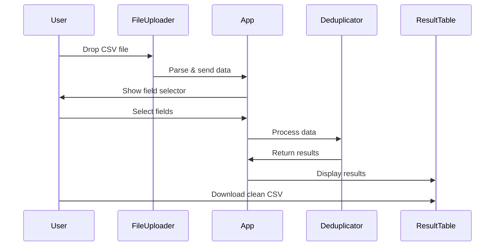

# Architecture

Overview of Uniquify's technical architecture and design decisions.

## System Architecture

```
┌─────────────────────────────────────────────────────┐
│                   Browser (Client)                   │
├─────────────────────────────────────────────────────┤
│                   React (Next.js)                    │
├──────────────────┬──────────────────┬───────────────┤
│   Components     │   Core Logic     │     Utils     │
├──────────────────┼──────────────────┼───────────────┤
│ • FileUploader   │ • deduplicate.ts │ • i18n        │
│ • FieldSelector  │ • diff.ts        │ • types       │
│ • ResultTable    │                  │               │
│ • DiffViewer     │                  │               │
└──────────────────┴──────────────────┴───────────────┘
```

## Key Design Decisions

### 1. Client-Side Processing

**Decision**: All CSV processing happens in the browser

**Rationale**:
- Privacy: No data leaves user's device
- Performance: No network latency
- Simplicity: No backend infrastructure needed
- Cost: Free hosting on GitHub Pages

**Trade-offs**:
- Limited by browser memory
- No persistent storage
- No multi-user collaboration

### 2. Static Site Generation

**Decision**: Use Next.js with static export

**Rationale**:
- GitHub Pages compatibility
- Fast page loads
- SEO friendly
- No server required

### 3. Component Architecture

**Decision**: Modular React components

**Structure**:
```
App (main orchestrator)
├── FileUploader (handles input)
├── FieldSelector (user choices)
├── ResultTable (displays results)
│   ├── CSVPreview
│   └── DiffViewer
└── LanguageSelector (i18n)
```

## Data Flow

### Upload → Process → Export



## Core Algorithms

### Deduplication Algorithm

```typescript
// Simplified algorithm
function deduplicate(data, fields) {
  const seen = new Set()
  const unique = []
  
  for (const row of data) {
    const key = fields.map(f => row[f]).join('|')
    if (!seen.has(key)) {
      seen.add(key)
      unique.push(row)
    }
  }
  
  return unique
}
```

**Complexity**: O(n) time, O(n) space

### Diff Calculation

```typescript
// Track which rows were kept/removed
function calculateDiff(original, processed) {
  const processedSet = new Set(processed)
  const kept = []
  const removed = []
  
  original.forEach((row, index) => {
    if (processedSet.has(row)) {
      kept.push(index)
    } else {
      removed.push(index)
    }
  })
  
  return { kept, removed }
}
```

## State Management

### React State Structure

```typescript
interface AppState {
  // Data
  csvData: any[]
  headers: string[]
  selectedFields: string[]
  result: DeduplicateResult | null
  
  // UI
  isLoading: boolean
  activeTab: 'after' | 'before' | 'diff'
  language: 'en' | 'ja'
}
```

### State Updates

- Immutable updates using React hooks
- No external state management library
- Local state in components where possible

## Performance Considerations

### Optimizations

1. **Lazy Loading**
   - Components loaded on demand
   - Reduce initial bundle size

2. **Memoization**
   - `useMemo` for expensive calculations
   - Prevent unnecessary re-renders

3. **Efficient Algorithms**
   - Single-pass deduplication
   - Set-based lookups (O(1))

### Benchmarks

| Rows | Processing Time |
|------|----------------|
| 1K   | < 100ms        |
| 10K  | < 1s           |
| 100K | < 10s          |

## Security

### Data Handling

- **No server communication**: All processing local
- **No persistence**: Data cleared on page refresh
- **No analytics**: No tracking or telemetry

### Content Security

- Static site with no dynamic content
- No user input reflected in HTML
- CSV parsing sanitizes data

## Extensibility

### Adding Features

1. **New deduplication modes**
   - Modify `deduplicate.ts`
   - Add UI options in `FieldSelector`

2. **Additional file formats**
   - Add parser in `FileUploader`
   - Update export in `ResultTable`

3. **New visualizations**
   - Create component in `components/`
   - Add to `ResultTable` tabs

### Plugin Points

- Custom field matchers
- Export formatters
- Data transformers

## Testing Strategy

### Unit Tests (TODO)

```typescript
// Example test structure
describe('deduplicateCSV', () => {
  it('removes exact duplicates', () => {
    // Test implementation
  })
  
  it('handles empty fields', () => {
    // Test implementation
  })
})
```

### Integration Tests (TODO)

- File upload flow
- End-to-end processing
- Export functionality

## Future Architecture Considerations

### Potential Enhancements

1. **Web Workers**
   - Offload processing to background thread
   - Prevent UI blocking on large files

2. **Streaming Processing**
   - Handle files larger than memory
   - Process in chunks

3. **IndexedDB Storage**
   - Temporary storage for large datasets
   - Resume interrupted sessions

4. **WebAssembly**
   - Performance-critical operations
   - Complex algorithms