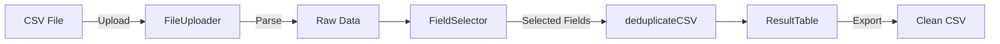

# API Reference

Technical reference for Uniquify's core functions and components.

## Core Functions

### `deduplicateCSV()`

The main deduplication function.

```typescript
function deduplicateCSV(
  data: any[],
  selectedFields: string[]
): DeduplicateResult
```

**Parameters:**
- `data`: Array of objects representing CSV rows
- `selectedFields`: Array of field names to use for matching

**Returns:**
```typescript
interface DeduplicateResult {
  data: any[]              // Deduplicated data
  totalRows: number        // Original row count
  uniqueRows: number       // Rows after deduplication
  duplicatesRemoved: number // Number of duplicates removed
}
```

### `calculateDiff()`

Calculates the difference between original and processed data.

```typescript
function calculateDiff(
  originalData: any[],
  processedData: any[],
  selectedFields: string[]
): DiffResult
```

**Returns:**
```typescript
interface DiffResult {
  kept: any[]           // Rows that were kept
  removed: any[]        // Rows that were removed
  keepIndices: number[] // Indices of kept rows
  removeIndices: number[] // Indices of removed rows
}
```

## Components

### FileUploader

Handles CSV file upload and parsing.

```typescript
interface FileUploaderProps {
  onFileUpload: (data: any[], headers: string[]) => void
  isLoading: boolean
  onLoadingChange: (loading: boolean) => void
}
```

**Events:**
- `onFileUpload`: Triggered when file is successfully parsed
- `onLoadingChange`: Loading state updates

### FieldSelector

UI for selecting fields for deduplication.

```typescript
interface FieldSelectorProps {
  fields: string[]
  selectedFields: string[]
  onFieldToggle: (field: string) => void
  onSelectAll: () => void
  onDeselectAll: () => void
  onDeduplicate: () => void
}
```

### ResultTable

Displays processing results with multiple views.

```typescript
interface ResultTableProps {
  result: DeduplicateResult | null
  originalData: any[]
  headers: string[]
  selectedFields: string[]
  onDeleteRow?: (data: any[], index: number) => void
}
```

## Data Flow



## File Format

### Input CSV Requirements

- Standard CSV format
- First row must contain headers
- UTF-8 encoding recommended
- No size limit (browser memory dependent)

### Output CSV Format

- Maintains original column order
- Preserves data types
- UTF-8 encoded
- Filename: `deduplicated_YYYY-MM-DD.csv`

## Internationalization

### Language Support

```typescript
type Language = 'ja' | 'en'

interface TranslationKeys {
  appTitle: string
  appDescription: string
  // ... other keys
}
```

### Using Translations

```typescript
import { useLanguage } from '../lib/i18n/context'

function Component() {
  const { t, language, setLanguage } = useLanguage()
  
  return <h1>{t('appTitle')}</h1>
}
```

## Browser APIs Used

- **FileReader API**: For reading uploaded files
- **Blob API**: For creating downloadable files
- **LocalStorage API**: For persisting language preference

## Performance Characteristics

| Operation | Complexity | Notes |
|-----------|------------|-------|
| Upload | O(n) | Linear with file size |
| Deduplication | O(n) | Single pass algorithm |
| Sorting | O(n log n) | When sorting columns |
| Export | O(n) | Linear with row count |

## Error Handling

Common error scenarios:

1. **Invalid CSV Format**
   - Missing headers
   - Malformed rows
   - Encoding issues

2. **Memory Limitations**
   - Files too large for browser
   - Solution: Process in chunks

3. **Browser Compatibility**
   - Unsupported APIs
   - Solution: Use modern browser